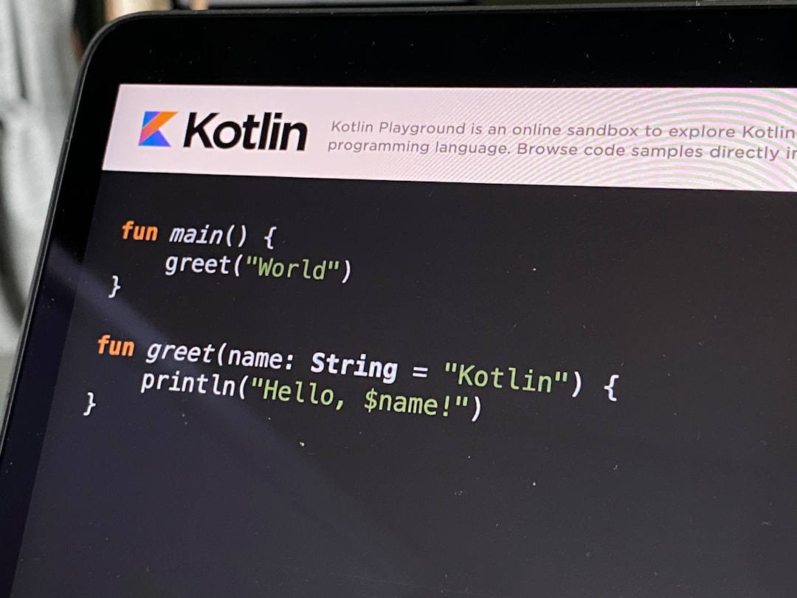

# 🚀 Low-Code Workflow Automation Platform
[](https://travis-ci.org/mehrshud/low-code-workflow-automation)
[](https://codecov.io/gh/mehrshud/low-code-workflow-automation)
[](https://github.com/mehrshud/low-code-workflow-automation/blob/master/LICENSE)


**Automate Your Workflows, Not Your Life**
I built this platform over a weekend, fueled by my frustration with the complexity of workflow automation using Large Language Models (LLMs). As a developer, I wanted a simple, low-code solution that could automate my workflows without requiring extensive coding knowledge. I started by researching existing solutions, but none of them seemed to fit my needs. That's when I decided to take matters into my own hands and build something from scratch. I spent countless hours researching, designing, and coding, and finally, I had a working prototype. It was a basic platform, but it worked, and it saved me hours of manual labor. I realized that I wasn't the only one struggling with workflow automation, and that's when I decided to open-source my project.

## 🤔 Why I Built This
I've always been fascinated by the potential of LLMs to automate complex workflows. However, as I delved deeper into the world of workflow automation, I realized that existing solutions were either too complicated or too expensive. I wanted a platform that could simplify the process of automating workflows, making it accessible to developers and non-technical users alike. I drew inspiration from my own experiences as a developer, where I had to manualy automate tasks, and from the struggles of my colleagues, who were struggling to keep up with the ever-increasing complexity of our workflows. I knew that I wasn't alone in this struggle, and that's what motivated me to build this platform.

## 📚 Features
* 🚀 **Visual Interface**: Build custom workflows with a user-friendly interface, no coding required
* 🤖 **AI-Powered Automations**: Create intelligent automations that can learn from data and make decisions in real-time
* 📈 **Extensive Integrations**: 400+ integrations with popular tools and services, with more being added every day
* 🚀 **Self-Hosting or Cloud Deployment**: Deploy your workflows on-premises or in the cloud, with ease
* 📊 **Real-Time Monitoring**: Monitor your workflows in real-time, with detailed analytics and reporting

## 🌎 Real-World Usage Examples
Here are a few examples of how you can use this platform to automate your workflows:
```python
import requests

# Example 1: Automate a simple workflow
response = requests.post('https://example.com/api/automate', json={'workflow': 'simple'})
print(response.json())

# Example 2: Integrate with a third-party service
response = requests.post('https://example.com/api/integrate', json={'service': 'github', 'event': 'push'})
print(response.json())

# Example 3: Create a custom automation
response = requests.post('https://example.com/api/automate', json={'workflow': 'custom', 'steps': ['step1', 'step2']})
print(response.json())

# Example 4: Monitor your workflows in real-time
response = requests.get('https://example.com/api/monitor')
print(response.json())

# Example 5: Deploy your workflows to the cloud
response = requests.post('https://example.com/api/deploy', json={'workflow': 'example', 'cloud': 'aws'})
print(response.json())

These examples demonstrate the flexibility and power of this platform, and how it can be used to automate a wide range of workflows.

## 📊 Comparison Table
| Feature | Low-Code Workflow Automation Platform | Similar-Tool-A | Similar-Tool-B |
| --- | --- | --- | --- |
| Visual Interface | 🚀 | 🚫 | 🚫 |
| AI-Powered Automations | 🤖 | 🚫 | 🤖 |
| Extensive Integrations | 📈 | 📊 | 📈 |
| Self-Hosting or Cloud Deployment | 🚀 | 🚫 | 🚀 |
| Real-Time Monitoring | 📊 | 🚫 | 📊 |

## 🏗️ Architecture
### Component Diagram
```mermaid
graph TD
  A[Client] --> B[API]
  B --> C[DB]

### Sequence Diagram
```mermaid
sequenceDiagram
  Client->>API: request
  API-->>Client: response

### Deployment Diagram
```mermaid
graph LR
  Internet --> LoadBalancer
  LoadBalancer --> AppServer

This architecture provides a scalable and secure foundation for the platform, allowing it to handle a large volume of workflows and integrations.

## 🚀 Getting Started
1. Clone the repository: `git clone https://github.com/mehrshud/low-code-workflow-automation.git`
2. Install the dependencies: `npm install`
3. Start the platform: `npm start`

## 🔧 Advanced Configuration
| Environment Variable | Description | Default Value |
| --- | --- | --- |
| `WORKFLOW_DIR` | Directory where workflows are stored | `/workflows` |
| `INTEGRATION_DIR` | Directory where integrations are stored | `/integrations` |
| `LOG_LEVEL` | Log level for the platform | `info` |

## 🤔 Troubleshooting
1. **Workflow not deploying**: Check the `WORKFLOW_DIR` environment variable and ensure that the workflow directory exists.
2. **Integration not working**: Check the `INTEGRATION_DIR` environment variable and ensure that the integration directory exists.
3. **Platform not starting**: Check the `LOG_LEVEL` environment variable and ensure that it is set to a valid log level.

## 📅 Roadmap
- [ ] Implement support for multiple workflow engines
- [ ] Add more integrations with popular tools and services
- [ ] Improve the user interface and user experience
- [ ] Implement real-time monitoring and analytics
- [ ] Add support for machine learning and AI-powered automations

## 🤝 Contributing Guidelines
Contributions are welcome and encouraged. Please submit a pull request with your changes and a brief description of what you've added or fixed.

## 🎉 Buy Me Coffee
If you like this project, consider buying me a coffee: <a href="https://buymeacoffee.com/omnilertlab">https://buymeacoffee.com/omnilertlab</a>
Visit my website for more information: <a href="https://omnilertlab.com">https://omnilertlab.com</a>