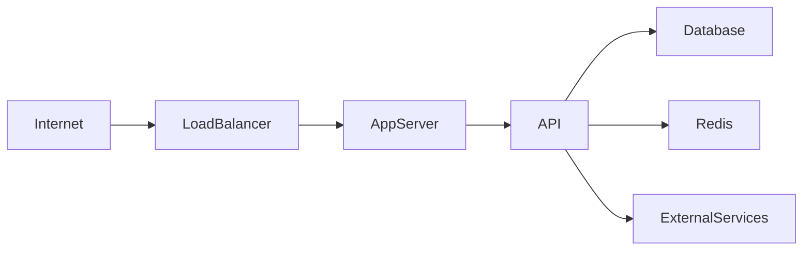
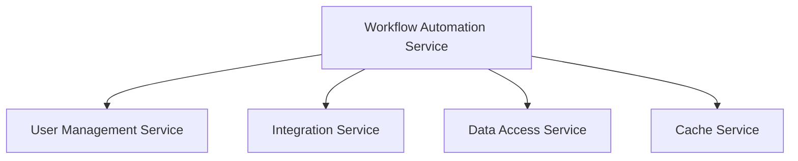
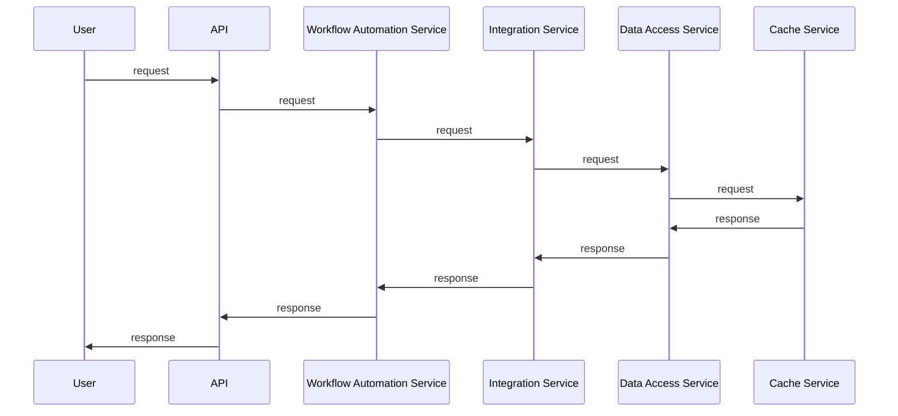
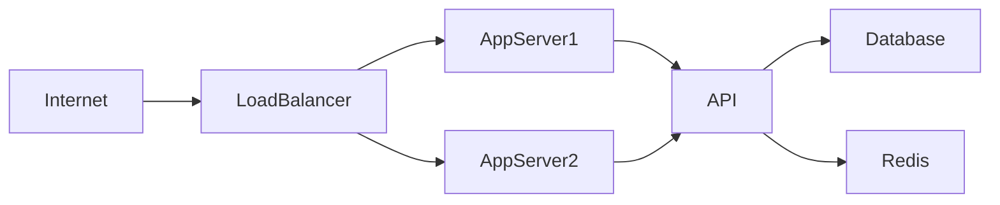

# Architecture
## System Overview
The Low-Code Workflow Automation Platform is designed to provide a user-friendly interface for automating workflows using n8n and LangChain. The platform aims to support various integrations and provide a scalable architecture to handle a large number of users and workflows. At the C4 Context level, the system can be represented as follows:
```mermaid
graph TD
  A[Users] -->|Use|> B[Low-Code Workflow Automation Platform]
  B -->|Integrate with|> C[External Services]
  B -->|Store data in|> D[Database]
```
The system interacts with users, external services, and a database to provide a seamless workflow automation experience.

## Container Architecture
The platform consists of several containers that work together to provide the workflow automation functionality. The containers are:
- **API**: Handles incoming requests from users and provides a user-friendly interface for workflow automation.
- **Database**: Stores workflow data, user information, and other relevant data.
- **Redis**: Provides a caching layer to improve performance and reduce the load on the database.
- **App Server**: Hosts the API and handles requests.
- **Load Balancer**: Distributes incoming traffic across multiple app servers to ensure scalability and high availability.
- **External Services**: Integrations with third-party services such as n8n and LangChain.

The container architecture can be represented as follows:


## Component Breakdown
The platform consists of several key components that work together to provide the workflow automation functionality. The components are:
- **Workflow Automation Service**: Responsible for automating workflows using n8n and LangChain.
- **User Management Service**: Handles user registration, login, and authentication.
- **Integration Service**: Provides integrations with external services such as n8n and LangChain.
- **Data Access Service**: Handles data access and storage in the database.
- **Cache Service**: Provides a caching layer using Redis to improve performance.

The components can be represented as follows:


## Data Flow
The data flow in the platform can be represented as follows:
1. **User Request**: A user sends a request to the API to automate a workflow.
2. **API**: The API receives the request and sends it to the Workflow Automation Service.
3. **Workflow Automation Service**: The Workflow Automation Service automates the workflow using n8n and LangChain.
4. **Integration Service**: The Integration Service provides integrations with external services such as n8n and LangChain.
5. **Data Access Service**: The Data Access Service handles data access and storage in the database.
6. **Cache Service**: The Cache Service provides a caching layer using Redis to improve performance.
7. **Response**: The API sends a response back to the user.

The data flow can be represented as follows:


## Design Patterns Used
The platform uses several design patterns to provide a scalable and maintainable architecture. The design patterns used are:
- **Microservices Architecture**: The platform is built using a microservices architecture, where each service is responsible for a specific functionality.
- **Service-Oriented Architecture**: The platform is built using a service-oriented architecture, where each service provides a specific functionality.
- **Repository Pattern**: The platform uses the repository pattern to abstract data access and storage.
- **Cache-Aside Pattern**: The platform uses the cache-aside pattern to improve performance by caching frequently accessed data.

The design patterns are used to provide a scalable and maintainable architecture, and to improve performance by reducing the load on the database.

## Scalability Considerations
The platform is designed to scale horizontally to handle a large number of users and workflows. The scalability considerations are:
- **Horizontal Scaling**: The platform can be scaled horizontally by adding more app servers to handle incoming traffic.
- **Caching**: The platform uses caching to improve performance and reduce the load on the database.
- **Queuing**: The platform can use queuing to handle asynchronous requests and improve performance.

The scalability considerations are used to provide a scalable architecture that can handle a large number of users and workflows.

## Security Model
The platform uses a security model that provides authentication, authorization, and data encryption. The security model is:
- **Authentication**: The platform uses authentication to verify user identity.
- **Authorization**: The platform uses authorization to control access to resources.
- **Data Encryption**: The platform uses data encryption to protect sensitive data.

The security model is used to provide a secure architecture that protects user data and prevents unauthorized access.

## Technology Rationale
The platform uses a technology stack that provides a scalable and maintainable architecture. The technology stack is:
- **Python**: The platform uses Python as the programming language.
- **FastAPI**: The platform uses FastAPI as the web framework.
- **PostgreSQL**: The platform uses PostgreSQL as the database management system.
- **Redis**: The platform uses Redis as the caching layer.
- **Docker**: The platform uses Docker as the containerization platform.

The technology stack is used to provide a scalable and maintainable architecture, and to improve performance by reducing the load on the database.

## Deployment Architecture
The platform is deployed using a deployment architecture that provides high availability and scalability. The deployment architecture is:

The deployment architecture is used to provide high availability and scalability, and to improve performance by reducing the load on the database.

## Future Architecture Evolution
The platform is designed to evolve and adapt to changing requirements. The future architecture evolution is:
- **Cloud-Native Architecture**: The platform can be evolved to use a cloud-native architecture to provide greater scalability and flexibility.
- **Serverless Architecture**: The platform can be evolved to use a serverless architecture to provide greater scalability and cost savings.
- **Artificial Intelligence**: The platform can be evolved to use artificial intelligence to provide greater automation and insights.

The future architecture evolution is used to provide a roadmap for the platform's future development and to ensure that the platform remains relevant and competitive.